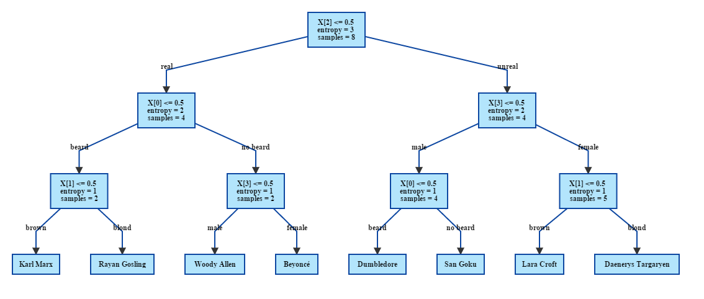

% Report MLG Lab 3
% Léonard Berney; Sacha Bron

## Exercise 0

Q: What does the "value" parameter indicates in the resulting tree of WebGraphViz ?  
A: It's an array containing the number of element of each classes that matches conditions of each previous nodes.

Q: What about the "X[0]" and "X[1]" parameters ?  
A: It's the columns of the variable we chose to split. (In the example, it's `Var0` and `Var1`).

Q: How much leaves does our tree have ? Which one are they ?  
A: The tree has 3 leaves, they are the nodes with an entropy of 0.0.

## Exercise 1

Q: What is the value of the entropy at the root node ?  
A: $-8 * {1 \over 8} * log_2({1 \over 8}) = 3$

Q: What is the value of the entropy in the both child nodes (left and right) if you decide to split on the "Beard" variable ?  
A:

* beard: $-3 * {1 \over 3} * log_2({1 \over 3}) = 1.58$  
* no beard: $-5 * {1 \over 5} * log_2({1 \over 5}) = 2.32$

entropy gain: $3 - ({3 \over 8} * 1.58 + {5 \over 8} * 2.32) = 0.95$

Q: Same question for the "Hair" variable ?  
A:

* brown: $-log_2({1 \over 6}) = 2.58$
* blond: $-log_2({1 \over 2}) = 1$

entropy gain: $3 - ({6 \over 8} * 2.58 + {2 \over 8} * 1) = 0.81$

Q: Same question for the "Real" variable ?  
A:

* real: $-log_2({1 \over 4}) = 2$
* unreal: $-log_2({1 \over 4}) = 2$

entropy gain: $3 - ({1 \over 2} * 2 + {1 \over 2} * 2) = 1$

Q: Same question for the "Sex" variable ?  
A:

* female: $-3 * {1 \over 3} * log_2({1 \over 3}) = 1.58$  
* male: $-5 * {1 \over 5} * log_2({1 \over 5}) = 2.32$

entropy gain: $3 - ({3 \over 8} * 1.58 + {5 \over 8} * 2.32) = 0.95$

### Second split

real: split on beard

* beard: $-log_2({1 \over 2}) = 1$
* no beard: $-log_2({1 \over 2}) = 1$

entropy gain: $1$

unreal: split on sex

* male: $-log_2({1 \over 2}) = 1$
* female: $-log_2({1 \over 2}) = 1$

entropy gain: $1$

### Third split

real, beard: split on hair

* brown: $-log_2(1) = 0$
* blond: $-log_2(1) = 0$

entropy gain: $1$

real, no beard: split on sex

* male: $-log_2(1) = 0$
* female: $-log_2(1) = 0$

entropy gain: $1$

unreal, female: split on hair

* brown: $-log_2(1) = 0$
* blond: $-log_2(1) = 0$

entropy gain: $1$

unreal, male: split on beard

* beard: $-log_2(1) = 0$
* no beard: $-log_2(1) = 0$

entropy gain: $1$

## Complete tree

Q: Are there more than one optimal solution ? Explain why...  
A: No, there is only one optimal solution because for each different variables we tried to split on, only one had the best entropy gain possible (i.e. 1).

## Exercise 2

Q: How many classes are there in that example ?  
A. There are 3 classes.

Q: What are the possible splits on a real variable (i.e. not 0-1 (binary)), such as the variables in the iris dataset ?  
A: One way is to discretize the variables in order to use the same technique we used previously. Another possibility is to use a technique called variance reduction which is the equivalent of what we did with entropy.

Q: Considering the previous question... are there any splits that are equivalent ? Why/Why not ?  
A: Just like before when we used binary variables it was possible to have multiple best splits, it is also the case here.

Q: Go and dig into scikit-learn documentation... What's the other splitting criterion for decision tree classifier (other than the entropy) ?  
A: It's the Gini coefficient. A coefficient measuring dispersion used specially for inequalities.
