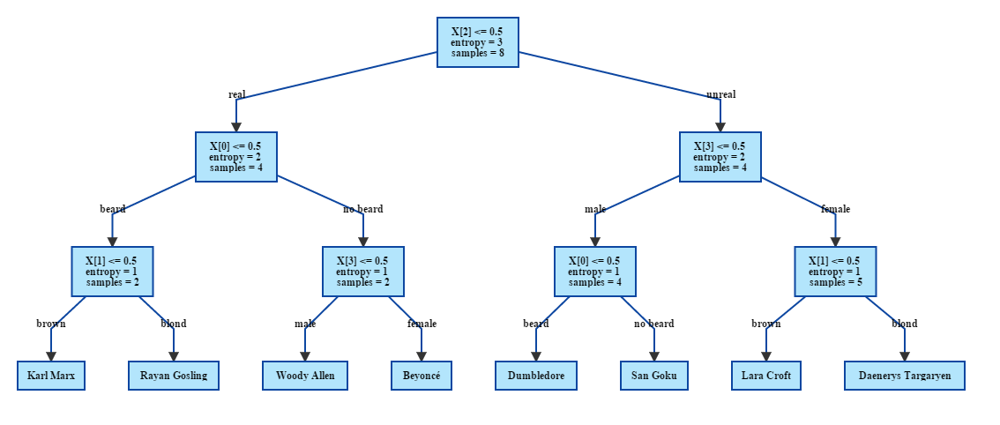

% Report MLG Lab 3
% Léonard Berney; Sacha Bron

## Exercise 0

Q: What does the "value" parameter indicates in the resulting tree of WebGraphViz ?  
A: It's an array containing the number of element of each classes that matches conditions of each previous nodes.

Q: What about the "X[0]" and "X[1]" parameters ?  
A: It's the columns of the variable we chose to split. (In the example, it's `Var0` and `Var1`).

Q: How much leaves does our tree have ? Which one are they ?  
A: The tree has 3 leaves, they are the nodes with an entropy of 0.0.

## Exercise 1

Q: What is the value of the entropy at the root node ?  
A: $-8 * {1 \over 8} * log_2({1 \over 8}) = 3$

Q: What is the value of the entropy in the both child nodes (left and right) if you decide to split on the "Beard" variable ?  
A:

* beard: $-3 * {1 \over 3} * log_2({1 \over 3}) = 1.58$  
* no beard: $-5 * {1 \over 5} * log_2({1 \over 5}) = 2.32$

entropy gain: $3 - ({3 \over 8} * 1.58 + {5 \over 8} * 2.32) = 0.95$

Q: Same question for the "Hair" variable ?  
A:

* brown: $-log_2({1 \over 6}) = 2.58$
* blond: $-log_2({1 \over 2}) = 1$

entropy gain: $3 - ({6 \over 8} * 2.58 + {2 \over 8} * 1) = 0.81$

Q: Same question for the "Real" variable ?  
A:

* real: $-log_2({1 \over 4}) = 2$
* unreal: $-log_2({1 \over 4}) = 2$

entropy gain: $3 - ({1 \over 2} * 2 + {1 \over 2} * 2) = 1$

Q: Same question for the "Sex" variable ?  
A:

* female: $-3 * {1 \over 3} * log_2({1 \over 3}) = 1.58$  
* male: $-5 * {1 \over 5} * log_2({1 \over 5}) = 2.32$

entropy gain: $3 - ({3 \over 8} * 1.58 + {5 \over 8} * 2.32) = 0.95$

### Second split

real: split on beard

* beard: $-log_2({1 \over 2}) = 1$
* no beard: $-log_2({1 \over 2}) = 1$

unreal: split on sex

* male: $-log_2({1 \over 2}) = 1$
* female: $-log_2({1 \over 2}) = 1$

### Third split

real, beard: split on hair

* brown: $-log_2(1) = 0$
* blond: $-log_2(1) = 0$

real, no beard: split on sex

* male: $-log_2(1) = 0$
* female: $-log_2(1) = 0$

unreal, female: split on hair

* brown: $-log_2(1) = 0$
* blond: $-log_2(1) = 0$

unreal, male: split on beard

* beard: $-log_2(1) = 0$
* no beard: $-log_2(1) = 0$

## Complete tree

